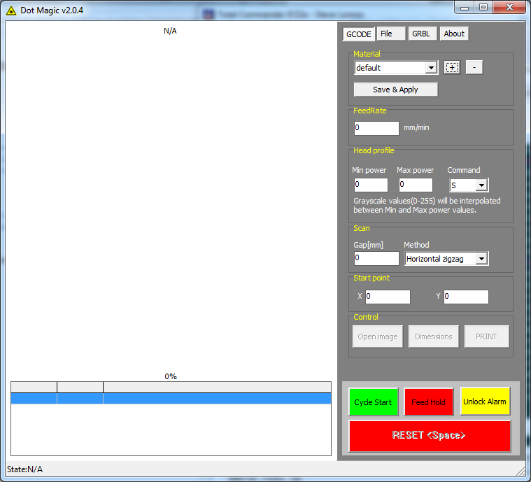
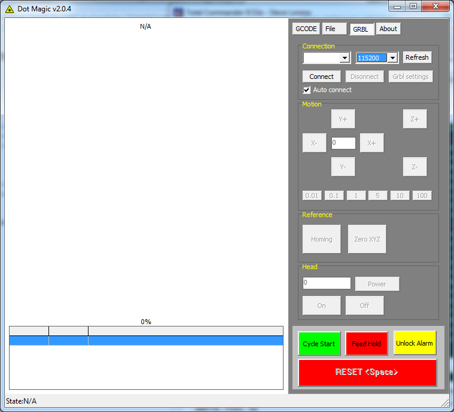

# Simple app for laser image engraving using GRBL



 
 The work principle is:

* Connect to your engraver
* Open prepared 8bit grayscale image in BMP format
* Adjust the initial parameters for engraving(feedrate, laser power, scan)
* If you want see where image will be printed on the material, click the button "Show dimensions". This will turn on the laser on minimum power (S0) and you will see rectangle where image will be printed
* Wear your laser safety goggles !!!
* Click "PRINT" to start engraving process.
* During the engraving you can adjust parameters such as feed rate and laser power. Changes become active only after pressing  "Save Apply" button. 


#### App generates following G-code for diagonal scan
```
F2600
G90
G21
G1S0M3
X0Y76.8S86.84
X0Y76.7S91.36
X0.1Y76.8S86.84
X0.2Y76.8S91.36
X0.1Y76.7S86.84
X0Y76.6S86.84
X0Y76.5S86.84
*******
M5M30
```
#### ... And for horizontal scan
```
F2600
G90
G21
G1S0M3
X0Y76.8S86.84
X0.1
X0.2S91.36
X0.3S86.84
X0.4
X0.5S91.36
X0.6S86.84
X0.7
X0.8S91.36
X0.9S86.84
X1
*******
M5M30
```
